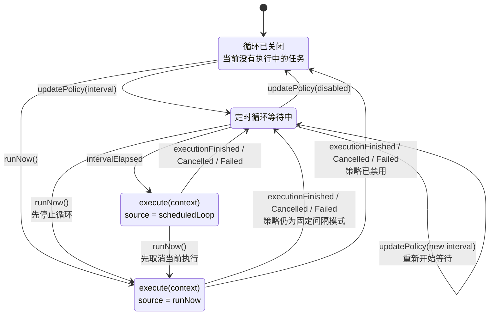
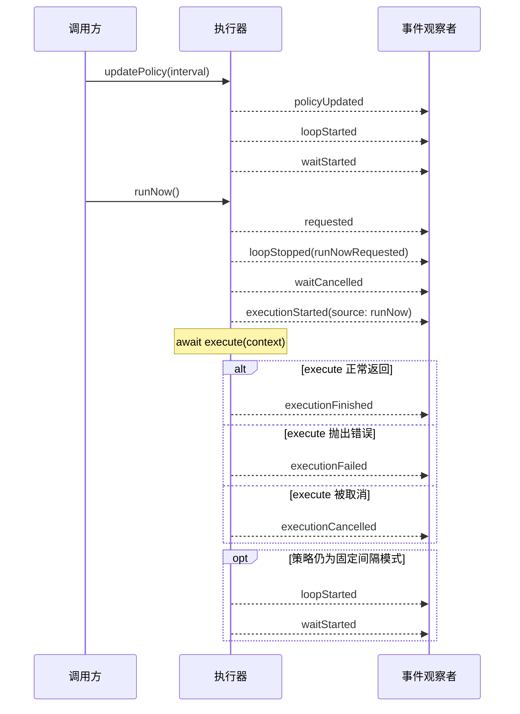

# Swift Sequential Executor

[](https://swiftpackageindex.com/shensven/swift-sequential-executor)
[](https://swiftpackageindex.com/shensven/swift-sequential-executor)
[](https://github.com/shensven/swift-sequential-executor/actions/workflows/pages/pages-build-deployment)

[English](README.md)｜简体中文

一个用于协调定时任务与立即执行请求的串行异步执行器。

## 为什么不直接用 Timer

[`Timer.scheduledTimer(...)`](https://developer.apple.com/documentation/foundation/timer/scheduledtimer(withtimeinterval:repeats:block:)) 适合“过一会儿再触发一次回调”这类需求。但当回调内部需要执行异步任务时，调用方往往还需要自己处理可能会遇到的并发协调问题。

## SequentialExecutor 提供了什么

- 按固定间隔执行异步任务，并避免与未完成的上一次执行重叠
- 在调度循环等待期间发起抢占式立即执行
- 在启动替代执行前，先协调取消并等待当前执行真正结束
- 提供稳定的开始、结束、取消、失败事件，方便接入日志、监控或 UI
- 完整的 [API 文档](https://shensven.github.io/swift-sequential-executor/documentation/sequentialexecutor/)

> [!TIP]
> 核心接口只聚焦在 `execute`、`eventHandler`、`events()`、`updatePolicy(_:)` 和 `runNow()`
>
> 其他细节都被封装在内部 ;-)

## 环境要求

| 平台 | Swift 版本 | 安装方式 | 状态 |
| --- | --- | --- | --- |
| macOS 13.0+<br>iOS 16.0+<br>tvOS 16.0+<br>watchOS 9.0+<br>visionOS 1.0+ | Swift 6.0+ / Xcode 16.0+ | Swift Package Manager | [](https://github.com/shensven/swift-sequential-executor/actions/workflows/tests-apple.yml) |
| Linux | Swift 6.0+ | Swift Package Manager | [](https://github.com/shensven/swift-sequential-executor/actions/workflows/tests-linux.yml) |

## 安装

### Swift Package Manager

只要你的 Swift 包或 Xcode 工程已经建立好，就可以把 `swift-sequential-executor` 添加到 `Package.swift` 的 `dependencies`，或者加到 Xcode 的包依赖列表里。

下面示例使用已经发布的 `1.0.0` 版本：

```swift
dependencies: [
    .package(url: "https://github.com/shensven/swift-sequential-executor.git", from: "1.0.0")
]
```

然后在 target 中依赖 `SequentialExecutor` 这个产物：

```swift
targets: [
    .target(
        name: "YourTarget",
        dependencies: [
            .product(name: "SequentialExecutor", package: "swift-sequential-executor")
        ]
    )
]
```

## 快速开始

```swift
import Foundation
import SequentialExecutor

let executor = SequentialExecutor(
    execute: { context in
        print("triggered by \(context.source)")
        try await Task.sleep(for: .seconds(2))
    },
    eventHandler: { event in
        print(event.kind)
    }
)

await executor.updatePolicy(.init(runLoop: .interval(.seconds(5))))
await executor.runNow()

```

这段代码可以放在任意异步上下文中运行，例如应用启动流程、异步测试，或者一个 `Task` 里。每次执行开始时，执行器都会把当前的 `ExecutionContext` 传给 `execute` 闭包；`updatePolicy(_:)` 用来开启固定间隔调度，`runNow()` 用来发起一次立即执行。

如果你不需要让初始化器里的 `execute` 参数接收上下文值，也可以使用一个更简洁的便利初始化器：

```swift
let executor = SequentialExecutor {
    try await Task.sleep(for: .seconds(2))
}
```

注意：如果事件处理本身比较重，或者更希望以异步流的方式消费事件，也可以通过 `events()` 订阅：

```swift
let executor = SequentialExecutor {
    try await Task.sleep(for: .seconds(2))
}

let eventTask = Task {
    for await event in await executor.events() {
        print(event.kind)
    }
}

await executor.runNow()
eventTask.cancel()
```

如果你想调试更完整的运行行为，可以继续查看[示例应用](#示例应用)。

## 行为概览

从高层来看，`SequentialExecutor` 的运行行为可以先抓住 3 个要点：

- 任意时刻只会有一个执行真正处于运行中
- `runNow()` 会发起一次立即执行，但不会粗暴打断一个已经在运行的任务
- 一次立即执行结束后，调度循环是否恢复，要看当前策略是否仍然保持启用

如果你现在只关心怎样把它接入到项目里，读到这里通常已经足够；如果你还想进一步理解完整的运行时模型，可以继续看下面的状态和执行流程。

<details>
<summary>状态模型</summary>

从可见的运行时状态来看，执行器可以用 4 个状态来描述：

- `Idle`：调度循环已关闭，当前没有任务在执行
- `Waiting`：调度循环已开启，正在等待下一个间隔到来
- `ScheduledExecution`：因为间隔到期而启动的一次执行
- `ImmediateExecution`：因为 `runNow()` 请求立即执行而启动的一次执行



</details>

<details>
<summary>替换执行流程</summary>

`runNow()` 不会并行叠加执行。它会协调一次替换执行；如果当前已经有任务在运行，就先等待取消协作完成。

更具体地说：

- 如果当前正处于等待下一个间隔的状态，那么这次等待会先被取消
- 如果当前已经有任务在执行，执行器会先请求取消该任务，并等待它返回
- 只有前一次执行真正结束后，替代执行才会开始
- 如果在这段取消协调尚未完成时又连续到来多个 `runNow()` 调用，较早的待处理请求会让位给最新的那个请求
- 每一次立即执行请求仍然都会被单独记录下来，但并不是每个请求都一定会真正启动一次执行
- 如果当前任务没有正确配合 cancellation，替代执行的开始时间就可能被延后
- 这次立即执行结束后，只有在当前策略仍然允许的前提下，调度循环才会恢复等待

下面这张时序图描述的是固定间隔策略已经生效时的一条代表性路径：



</details>

## 示例应用

仓库里包含一个 SwiftUI 示例应用，位置在 [`Examples/SequentialExecutorExample`](Examples/SequentialExecutorExample)。

你可以用它调试和观察 `SequentialExecutor` 的运行时行为，包括调度循环变化、立即执行、取消协调，以及生命周期事件的发出顺序。这个示例会把可见状态保持为事件驱动，方便直接检查等待与执行的时间线变化。

## 许可证

`swift-sequential-executor` 基于 MIT License 发布。详情请查看 [LICENSE](LICENSE)。
