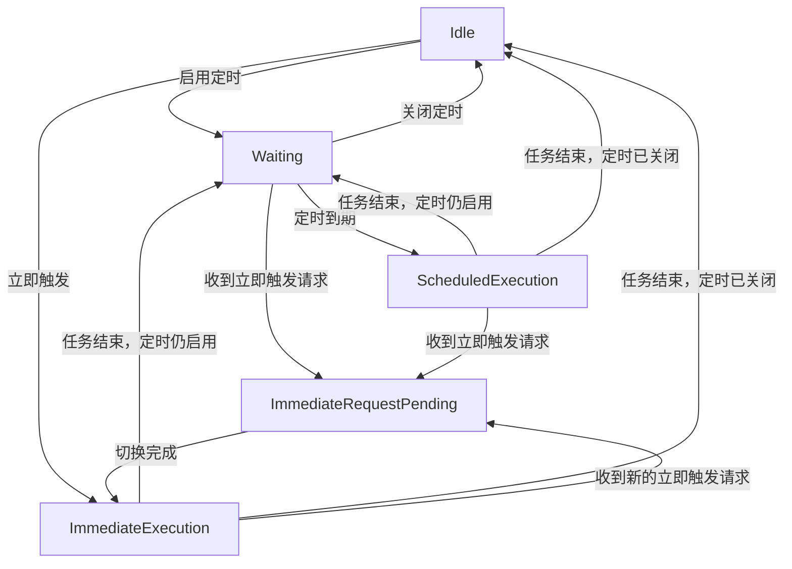
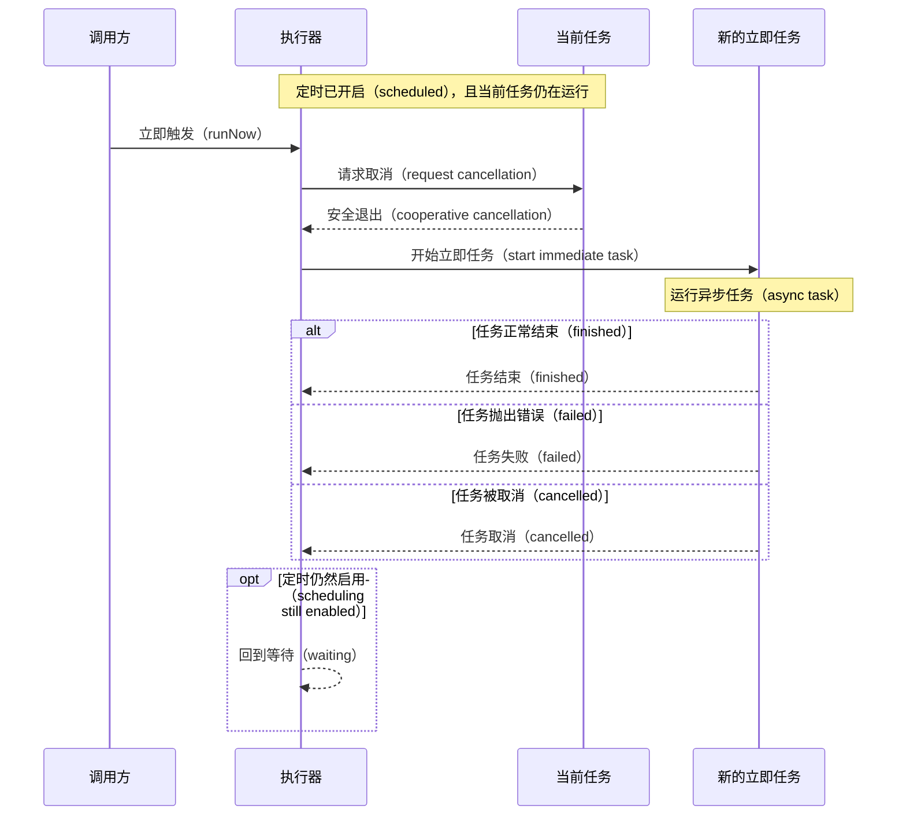

# Swift Sequential Executor

[](https://swiftpackageindex.com/shensven/swift-sequential-executor)
[](https://swiftpackageindex.com/shensven/swift-sequential-executor)

[English](README.md)｜简体中文

让异步任务逐个执行，可定时运行，也可按需触发。

## 为什么不直接用 Timer

[`Timer.scheduledTimer(...)`](https://developer.apple.com/documentation/foundation/timer/scheduledtimer(withtimeinterval:repeats:block:)) 适合“过一会儿再触发一次回调”这类需求。但当回调内部需要执行异步任务时，调用方往往还需要自己处理可能会遇到的并发协调问题。

## SequentialExecutor 提供了什么

- [x] 按固定间隔运行异步任务
- [x] 需要时可以立即触发一次异步任务
- [x] 如果上一次还没结束，不会同时再跑一个，并会安全切换任务
- [x] 提供开始、结束、取消、失败等生命周期事件，方便接入日志、监控或 UI
- [x] 完整的 [API 文档](https://swiftpackageindex.com/shensven/swift-sequential-executor/main/documentation/sequentialexecutor/)

> [!TIP]
> 核心接口只聚焦在 `execute`、`updatePolicy(_:)` 和 `runNow()`
>
> 其他细节都被封装在内部 ;-)

## 环境要求

| 平台 | Swift 版本 | 安装方式 | 状态 |
| --- | --- | --- | --- |
| macOS 13.0+<br>iOS 16.0+<br>tvOS 16.0+<br>watchOS 9.0+<br>visionOS 1.0+ | Swift 6.0+ / Xcode 16.0+ | Swift Package Manager | [](https://github.com/shensven/swift-sequential-executor/actions/workflows/tests-apple.yml) |
| Linux | Swift 6.0+ | Swift Package Manager | [](https://github.com/shensven/swift-sequential-executor/actions/workflows/tests-linux.yml) |
| Windows | Swift 6.1+ | Swift Package Manager | [](https://github.com/shensven/swift-sequential-executor/actions/workflows/tests-windows.yml) |

## 安装

### Swift Package Manager

只要你的 Swift 包或 Xcode 工程已经建立好，就可以把 `swift-sequential-executor` 添加到 `Package.swift` 的 `dependencies`，或者加到 Xcode 的包依赖列表里。

下面示例使用已经发布的 `1.0.0` 版本：

```swift
dependencies: [
    .package(url: "https://github.com/shensven/swift-sequential-executor.git", from: "1.0.0")
]
```

然后在 target 中依赖 `SequentialExecutor` 这个产物：

```swift
targets: [
    .target(
        name: "YourTarget",
        dependencies: [
            .product(name: "SequentialExecutor", package: "swift-sequential-executor")
        ]
    )
]
```

## 快速开始

```swift
import Foundation
import SequentialExecutor

let executor = SequentialExecutor(
    execute: { context in
        print("triggered by \(context.source)")
        try await Task.sleep(for: .seconds(2))
    },
    eventHandler: { event in
        print(event.kind)
    }
)

await executor.updatePolicy(.init(runLoop: .interval(.seconds(5))))
// await executor.runNow()

```

这段代码可以放在任意异步上下文中运行，例如应用启动流程、异步测试，或者一个 `Task` 里。每次执行开始时，执行器都会把当前的 `ExecutionContext` 传给 `execute` 闭包；`updatePolicy(_:)` 用来开启固定间隔调度，`runNow()` 用来发起一次立即执行。

如果你不需要让初始化器里的 `execute` 参数接收上下文值，也可以使用一个更简洁的便利初始化器：

```swift
let executor = SequentialExecutor {
    try await Task.sleep(for: .seconds(2))
}
```

注意：如果事件处理本身比较重，或者更希望以异步流的方式消费事件，也可以通过 `events()` 订阅：

```swift
let executor = SequentialExecutor {
    try await Task.sleep(for: .seconds(2))
}

let eventTask = Task {
    for await event in await executor.events() {
        print(event.kind)
    }
}

await executor.runNow()
```

如果你想调试更完整的运行行为，可以继续查看[示例应用](#示例应用)。

## 行为概览

从使用角度看，可以先记住 3 个核心行为：

- 同一时间只会运行一个异步任务
- 可以按固定间隔运行，也可以随时立即触发
- 当新任务需要接管时，会先请求当前任务通过协作式取消（cooperative task cancellation）安全退出，而不是直接打断它

如果你现在只关心怎样把它接入到项目里，读到这里通常已经足够；如果你还想进一步理解完整的状态机设计，可以继续看下面的协调模型和轮替流程。

<details>
<summary>协调模型</summary>

执行器有 5 个主要状态，下面这张图展示了它们之间的流转：

- `Idle`：没有运行中的任务，也没有待处理的立即触发请求
- `Waiting`：正在等待下一次定时触发
- `ScheduledExecution`：定时触发的任务正在运行
- `ImmediateRequestPending`：立即触发请求已经到来，正在等待切换
- `ImmediateExecution`：立即触发的任务正在运行



- 在 `Waiting` 中更新定时间隔后，状态仍然保持在 `Waiting`
- 在 `ImmediateRequestPending` 中如果又收到新的立即触发请求，状态不变，但较早的待处理请求会让位给最新请求

</details>

<details>
<summary>轮替流程</summary>

当你发起一次立即触发时，执行器不会把新任务直接叠加到当前任务上，而是先把当前状态整理好，再把控制权交给新的那次运行，也就是一次任务接管。

更具体地说：

- 如果当前还在等待下一次定时触发，这段等待会先结束
- 如果当前已经有任务在运行，执行器会先请求它通过协作式取消（cooperative cancellation）安全退出
- 只有前一个任务真正结束后，新的立即任务才会开始
- 如果切换过程中又连续收到多次立即触发请求，最后一次会接管（take over），前面的待处理请求会让位
- 如果当前任务没有正确配合 cancellation，新的立即任务就只能继续等待
- 这次立即任务结束后，如果定时仍然启用，执行器会回到等待状态

下面这张时序图描述的是“当前已经有任务在运行，此时又收到一次立即触发”的典型接管路径：



</details>

## 示例应用

仓库里包含一个 SwiftUI 示例应用，位置在 [`Examples/SequentialExecutorExample`](Examples/SequentialExecutorExample)。

你可以用它调试和观察 `SequentialExecutor` 的运行时行为，包括调度循环变化、立即执行、取消协调，以及生命周期事件的发出顺序。这个示例会把可见状态保持为事件驱动，方便直接检查等待与执行的时间线变化。

## 许可证

`swift-sequential-executor` 基于 MIT License 发布。详情请查看 [LICENSE](LICENSE)。
