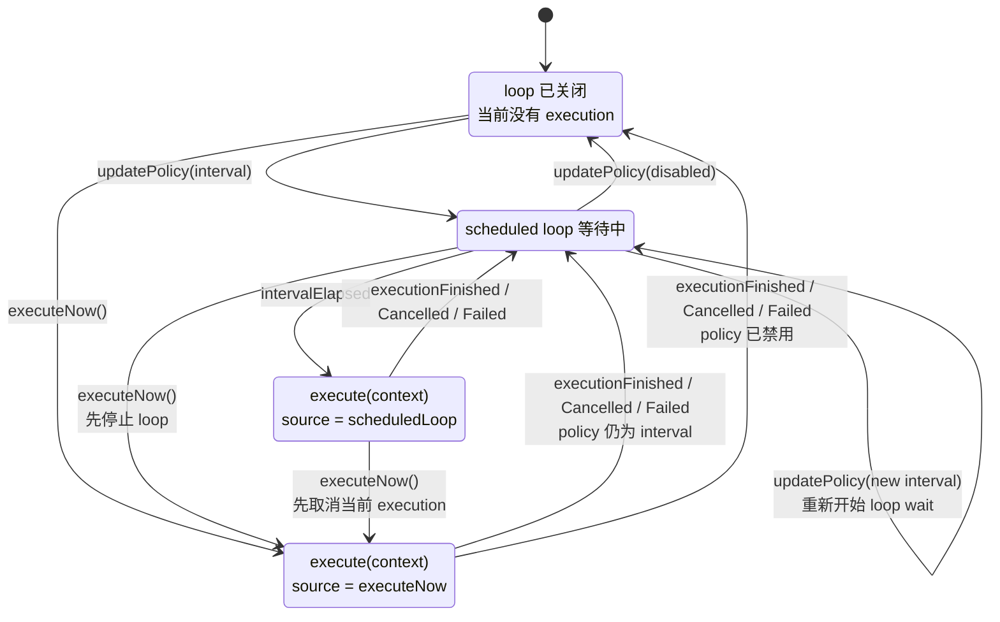
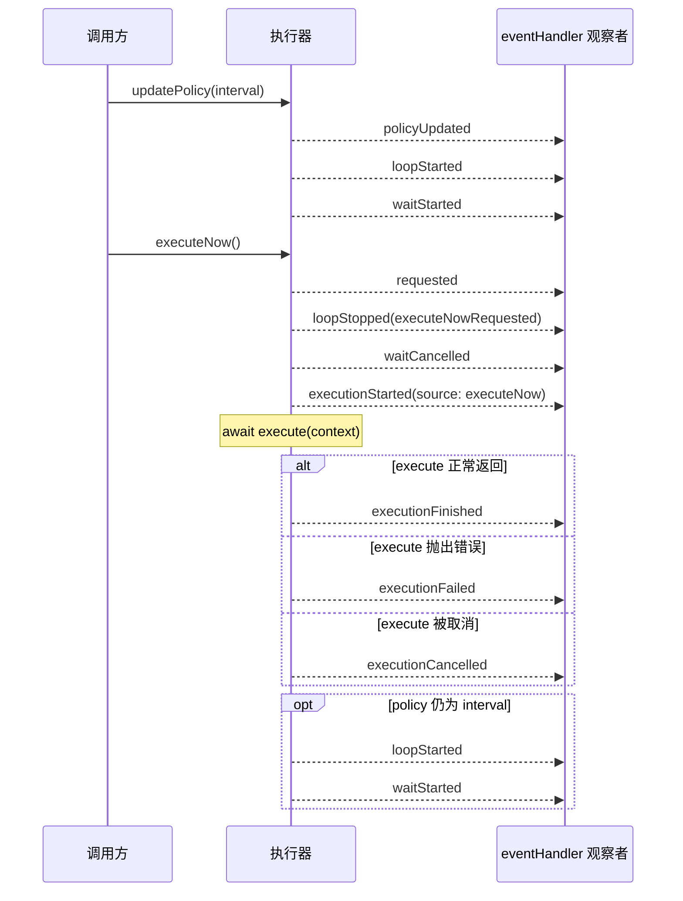

# Swift Sequential Executor

[](https://github.com/shensven/swift-sequential-executor/actions/workflows/tests.yml)

[English](README.md)｜简体中文

## Why?

Apple 的 [`Timer.scheduledTimer(...)`](<https://developer.apple.com/documentation/foundation/timer/scheduledtimer(withtimeinterval:repeats:block:)>) 文档描述的是：它会把 timer 加到当前线程的 run loop 上。而在 Apple 的 [Run Loop 指南](https://developer.apple.com/library/archive/documentation/Cocoa/Conceptual/Multithreading/RunLoopManagement/RunLoopManagement.html) 里也明确提到，timer 并不是实时机制；它是否按时触发，取决于 run loop 是否正在运行、是否处于正确的 mode、以及当时是否有机会处理回调。

当需求只是“过一会儿再回调我一次”时，这没有问题。真正的痛点出现在你需要协调异步任务执行时：

- 它只负责把回调调度到 run loop 上，但并不知道上一次异步任务是否已经结束
- `repeats: true` 只表示 timer 会继续触发，并不等于任务会串行执行；重叠执行和重入控制仍然要你自己处理
- 当定时触发和手动触发同时存在时，`Timer` 本身并没有提供等待、抢占或取消的协调模型

## `SequentialExecutor` 闪亮登场！

- 任务按顺序运行，不会重叠，同一时刻只会执行一个任务
- 只有一个调度循环，开启、关闭和间隔变化都通过 `updatePolicy(_:)` 明确控制
- `executeNow()` 会打断当前等待，必要时取消当前正在执行的任务，让新的请求优先开始
- `eventHandler` 会收到带 `emittedAt`、`executionID` 和 `source` 的有序事件回调

> [!TIP]
> 核心接口只聚焦在 `execute`、`eventHandler`、`updatePolicy(_:)` 和 `executeNow()`
>
> 其他细节都被封装在内部 ;-)

## 安装

### Swift Package Manager

只要你的 Swift package 或 Xcode 工程已经建立好，就可以把 `swift-sequential-executor` 添加到 `Package.swift` 的 `dependencies`，或者加到 Xcode 的 package dependency 列表里。

这个仓库目前还没有发布版本 tag，所以下面的示例先使用 `branch: "main"`：

```swift
dependencies: [
    .package(url: "https://github.com/shensven/swift-sequential-executor.git", branch: "main")
]
```

然后在 target 中依赖 `SequentialExecutor` 这个 product：

```swift
targets: [
    .target(
        name: "YourTarget",
        dependencies: [
            .product(name: "SequentialExecutor", package: "swift-sequential-executor")
        ]
    )
]
```

## 快速开始

```swift
import SequentialExecutor

let executor = SequentialExecutor(
    execute: { context in
        print("run", context.executionID, context.source)
        try await doWork()
    },
    eventHandler: { event in
        print(event.emittedAt, event.kind)
    }
)

await executor.updatePolicy(.init(runLoop: .interval(.seconds(5))))
await executor.executeNow()
```

## 初始化器参数说明

| 参数 | 作用 | 回调内容 |
| --- | --- | --- |
| `execute` | 真正执行业务工作的闭包。`SequentialExecutor` 每次启动一次 execution 时，都会带着当前 execution context 调用它一次。 | 一个 `context` 参数，包含当前执行的元数据，例如 `executionID` 和 `source`。 |
| `eventHandler` | 生命周期事件观察器。它会按顺序接收执行事件，方便你做日志、监控或同步外部状态。 | 一个 `event` 参数，用来描述一次生命周期变化，包含 `emittedAt`、`executionID`、`source` 和 `kind`。 |

如果你不需要让初始化器里的 `execute` 参数接收 `context` 值，也可以使用一个更简洁的便利初始化器：

```swift
let executor = SequentialExecutor(
    execute: {
        try await doWork()
    },
    eventHandler: { event in
        print(event.kind)
    }
)
```

### 调度策略

这里列出的是 `SequentialExecutor.Policy` 的公开配置方式。

| API | 含义 | 说明 |
| --- | --- | --- |
| `Policy(runLoop: .disabled)` | 关闭调度循环，不会再启动基于 interval 的执行。 | 通过 `updatePolicy(_:)` 应用。 |
| `Policy(runLoop: .interval(duration))` | 开启调度循环，并在每次执行之间等待 `duration`。 | 通过 `updatePolicy(_:)` 应用，且 `duration` 必须大于 0。 |

### 执行上下文

这里列出的是 `SequentialExecutor.ExecutionContext` 的字段。

| 字段 | 含义 |
| --- | --- |
| `executionID` | 当前这次 execution 的唯一标识。它会和对应的 execution 生命周期事件保持一致。 |
| `source` | 触发这次 execution 的来源：要么是 `executeNow(requestID:)`，要么是 `scheduledLoop(loopID:)`。 |

### 事件枚举

这里列出的是 `SequentialExecutor.Event.Kind` 的所有 case。

| `event.kind` | 含义 |
| --- | --- |
| `requested(requestID:)` | 通过 `executeNow()` 发起了一次抢占式立即执行请求。 |
| `executionStarted(executionID:source:)` | 一次 execution 已经开始，且即将进入 `execute(context)`。 |
| `executionFinished(executionID:source:)` | 一次 execution 成功完成。 |
| `executionCancelled(executionID:source:)` | 一次 execution 被取消。 |
| `executionFailed(executionID:source:error:)` | 一次 execution 因错误失败。 |
| `policyUpdated(previous:new:)` | executor 的策略配置已更新。 |
| `loopStarted(loopID:)` | 一个新的调度循环已经启动。 |
| `loopStopped(loopID:reason:)` | 当前调度循环被请求停止。 |
| `loopExited(loopID:)` | 当前调度循环已经完全退出。 |
| `waitStarted(loopID:interval:)` | 调度循环开始等待下一个 interval。 |
| `waitCancelled(loopID:)` | 当前等待被取消。 |
| `waitFailed(loopID:error:)` | 当前等待因错误失败。 |
| `intervalElapsed(loopID:)` | 配置的 interval 已到期，调度循环可以继续安排执行。 |

### 循环停止原因

这里列出的是 `SequentialExecutor.LoopStopReason` 的所有 case。

| `reason` | 含义 |
| --- | --- |
| `executeNowRequested` | 调度循环因为 `executeNow()` 发起抢占式立即执行而被停止。 |
| `policyDisabled` | 调度循环因为当前策略关闭了 scheduled execution 而被停止。 |
| `policyUpdated` | 调度循环因为策略变更，需要从干净状态重新启动调度而被停止。 |

## 行为说明

### 状态模型

从可见的运行时状态来看，executor 可以用 4 个状态来描述：

- `Idle`：调度循环已关闭，当前没有任务在执行
- `Waiting`：调度循环已开启，正在等待下一个 interval 到来
- `ScheduledExecution`：因为 interval 到期而启动的一次执行
- `ImmediateExecution`：因为 `executeNow()` 请求立即执行而启动的一次执行



### 抢占流程

`executeNow()` 是这个类型最关键的协调语义。它不会并行叠加执行，而是先抢占当前调度状态，再启动一份新的立即执行。

更具体地说：

- 如果当前正处于等待下一个 interval 的状态，那么这次等待会先被取消
- 如果当前已经有任务在执行，那么这次执行会先被取消
- 随后才会启动新的立即执行，而且只会启动一次
- 这次立即执行结束后，只有在当前 policy 仍然允许的前提下，调度循环才会恢复等待

下面这张时序图描述的是 interval policy 已经生效时的一条代表性路径：



## API 保证

- `execute` 是唯一的工作回调。每次开始的执行都只会进入这个闭包一次。
- `eventHandler` 是唯一的生命周期观察通道。`SequentialExecutor` 会在自身协调路径上，按事件发出顺序同步调用它。
- `updatePolicy(_:)` 只负责修改调度循环策略。
- `executeNow()` 请求一次更高优先级的立即执行，并且可能会先取消当前正在进行中的执行。

这个观察接口的契约有意保持得很窄：

- `eventHandler` 只负责观察，不负责控制。它应该保持轻量且非阻塞。
- 如果观察者把事件再转发到别的 actor、queue 或 UI 线程，后续显示延迟属于观察层，不属于 `SequentialExecutor`。
- `Event.emittedAt` 记录的是 executor 发出事件的时间。
- `ExecutionContext.executionID` 和 `ExecutionContext.source` 会与对应的 `executionStarted`、`executionFinished`、`executionCancelled`、`executionFailed` 事件保持一致。

## 示例应用

仓库里包含一个 SwiftUI Example app，位置在 [`Examples/SequentialExecutorExample`](Examples/SequentialExecutorExample)。

这个 Example 有意把两层状态分开：

- 期望配置（desired configuration）：用户当前选择的 RunLoop 控件值和下一次执行策略
- 运行时状态（runtime state）：`SequentialExecutor` 当前已应用的调度循环策略，以及由事件驱动的等待 / 执行圆环

在 Example 的 `ViewModel` 里，`PreparedExecution` 只是一个本地桥接状态，用来在对应的生命周期事件渲染出来之前，先按 `executionID` 冻结一份执行计划。可见的运行时状态仍然保持事件驱动。
