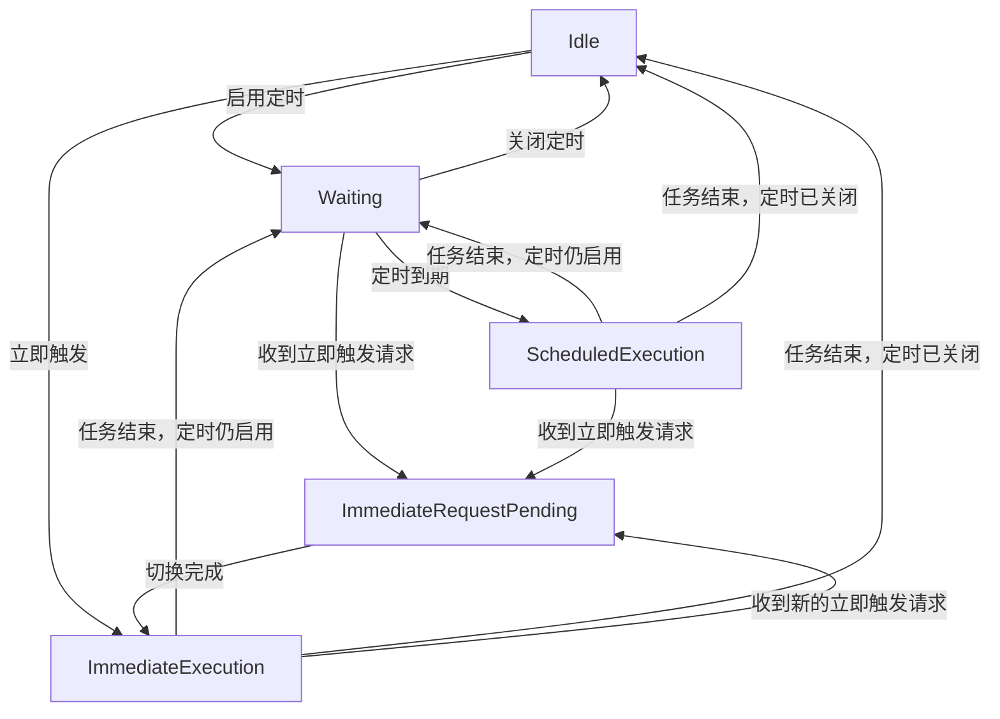
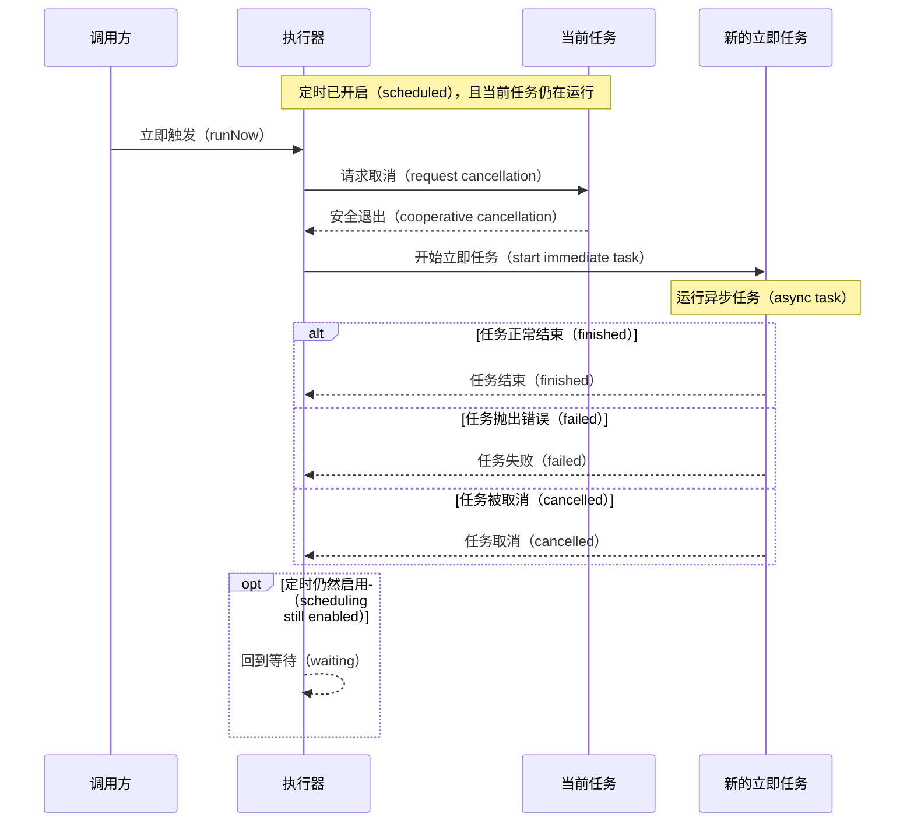
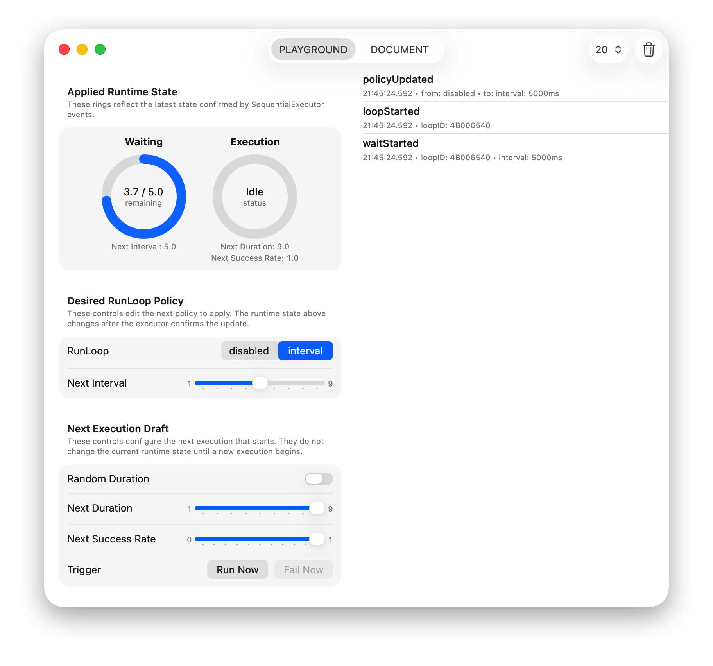

# Swift Sequential Executor

[](https://swiftpackageindex.com/shensven/swift-sequential-executor)
[](https://swiftpackageindex.com/shensven/swift-sequential-executor)

[English](README.md)｜简体中文

让异步任务逐个执行，可按固定延迟运行，也可立即触发并优先于定时任务。

## 为什么不直接用 Timer

[`Timer.scheduledTimer(...)`](https://developer.apple.com/documentation/foundation/timer/scheduledtimer(withtimeinterval:repeats:block:)) 用于调度同步回调。用它执行异步工作时，还需要额外处理任务重叠和取消协调。

## SequentialExecutor 提供了什么

- [x] 按固定延迟依次运行异步任务
- [x] 支持优先于定时调度的立即执行
- [x] 通过一个状态机，处理间隔等待、异步任务执行、立即触发请求等不同状态之间的协调
- [x] 提供状态机的事件回调接口，方便接入日志、监控或 UI
- [x] 完整的 [API 文档](https://swiftpackageindex.com/shensven/swift-sequential-executor/main/documentation/sequentialexecutor/)

> [!TIP]
> 核心接口只聚焦在 `execute`、`updatePolicy(_:)` 和 `runNow()`
>
> 其他细节都被封装在内部 ;-)

## 环境要求

| 平台 | Swift 版本 | 安装方式 | 状态 |
| --- | --- | --- | --- |
| macOS 13.0+<br>iOS 16.0+<br>tvOS 16.0+<br>watchOS 9.0+<br>visionOS 1.0+ | Swift 6.0+ / Xcode 16.0+ | Swift Package Manager | [](https://github.com/shensven/swift-sequential-executor/actions/workflows/tests-apple.yml) |
| Linux | Swift 6.0+ | Swift Package Manager | [](https://github.com/shensven/swift-sequential-executor/actions/workflows/tests-linux.yml) |
| Windows | Swift 6.1+ | Swift Package Manager | [](https://github.com/shensven/swift-sequential-executor/actions/workflows/tests-windows.yml) |

## 安装

### Swift Package Manager

只要你的 Swift 包或 Xcode 工程已经建立好，就可以把 `swift-sequential-executor` 添加到 `Package.swift` 的 `dependencies`，或者加到 Xcode 的包依赖列表里。

添加 `1.1.2` 或更高版本：

```swift
dependencies: [
    .package(url: "https://github.com/shensven/swift-sequential-executor.git", from: "1.1.2")
]
```

然后在 target 中依赖 `SequentialExecutor` 这个产物：

```swift
targets: [
    .target(
        name: "YourTarget",
        dependencies: [
            .product(name: "SequentialExecutor", package: "swift-sequential-executor")
        ]
    )
]
```

## 快速开始

```swift
import Foundation
import SequentialExecutor

let executor = SequentialExecutor(
    execute: { context in
        print("triggered by \(context.source)")
        try await Task.sleep(for: .seconds(2))
    },
    eventHandler: { event in
        print(event.kind)
    }
)

await executor.updatePolicy(.init(runLoop: .interval(.seconds(5))))
// await executor.runNow()
```

每次执行都会收到包含执行标识和触发来源的 `ExecutionContext`。使用
`updatePolicy(_:)` 配置固定延迟调度；使用 `runNow()` 请求一次优先于定时任务的立即执行。

如果你不需要让初始化器里的 `execute` 参数接收上下文值，也可以使用一个更简洁的便利初始化器：

```swift
let executor = SequentialExecutor {
    try await Task.sleep(for: .seconds(2))
}
```

`eventHandler` 是 `@Sendable` 闭包，并且会在执行器的协调路径上同步调用。请保持处理逻辑轻量，不要在其中同步访问其他隔离域的状态，例如 MainActor UI 状态。需要隔离或异步处理事件时，请通过 `events()` 订阅：

```swift
let executor = SequentialExecutor {
    try await Task.sleep(for: .seconds(2))
}

let eventTask = Task {
    for await event in await executor.events() {
        print(event.kind)
    }
}

await executor.runNow()
```

### 立即执行结果

`runNow()` 返回 `RunNowResult`。`execute` 抛出的错误会作为 `.failed` 结果返回，
同时也会通过 `executionFailed` 事件传递：

```swift
switch await executor.runNow() {
case let .finished(context):
    print("执行完成：\(context.executionID)")
case let .cancelled(context):
    print("执行取消：\(context.executionID)")
case let .failed(context, error):
    print("执行失败：\(context.executionID)，\(error)")
case let .superseded(requestID, byRequestID):
    print("请求 \(requestID) 已被请求 \(byRequestID) 取代")
}
```

| 结果 | 含义 |
| --- | --- |
| `finished` | 请求已经开始，并成功完成。 |
| `cancelled` | 请求已经开始，随后通过取消退出。 |
| `failed` | 请求已经开始，并抛出了非取消错误。 |
| `superseded` | 请求尚未开始，就被更新请求取代。 |

取消调用方的 `Task` 不会撤回已经提交给执行器的请求。新的 `runNow()` 请求才会
请求当前执行通过协作式取消退出。

调用方不需要处理结果时，可以忽略返回值。

### 选择合适的生命周期

`SequentialExecutor` 适合由长生命周期服务或模型持有，并且同时需要固定延迟调度和
“最新立即请求接管”语义的场景。执行器应该存放在真正拥有调度策略的对象中。

如果循环生命周期与单个 SwiftUI View 完全一致，使用 `.task(id:)` 配合
`Clock.sleep(for:)` 的结构化循环通常更简单：View 消失时 SwiftUI 会自动取消任务。
`SequentialExecutor` 会在请求提交后自行持有工作，因此取消 `.task` 或 `.refreshable`
的调用方，不会停止一个已经被 `runNow()` 接受的请求。

`execute` 闭包必须及时响应协作式取消。如果它正在等待一个非结构化子任务，或者等待
不会响应取消的 API，新的 `runNow()` 请求就只能等到旧工作返回后才能接管。

从多个独立 Task 调用 `updatePolicy(_:)` 时，策略按照 actor 实际收到调用的顺序应用，
这个顺序不保证与 Task 创建顺序一致。应让一个对象统一拥有策略更新，或者在调用方显式
串行化；不要从互不相关的 Task 竞争式地 fire-and-forget 更新策略。

### 事件观察

`events()` 只观察订阅创建之后发出的事件，不会重放历史事件。其默认缓冲区没有
容量上限；需要限制缓冲时，可以使用 `events(bufferingPolicy:)`，但有界缓冲可能丢弃
事件，并且不会额外发出丢弃通知。处理循环生命周期时应使用 `loopID` 关联事件：
同一个循环内的事件保持有序，但正在退出的旧循环与替代它的新循环之间可能交错。

## 行为概览

`SequentialExecutor` 提供以下保证：

- 同一时间只会运行一个异步任务
- 定时任务按固定延迟运行，也可以随时立即触发
- 新任务接管时，当前任务通过协作式取消（cooperative cancellation）退出

### 调度语义

定时执行采用固定延迟（fixed-delay），而不是固定频率（fixed-rate）：

```text
等待 interval → 执行 → 等待 interval → 执行
```

- 启用定时后，会先完整等待一个 interval，再开始第一次执行。
- 上一次执行退出后才开始下一次等待，执行耗时不会从延迟中扣除。
- 禁用定时会取消正在进行的等待，但不会取消已经开始的执行。
- 修改 interval 会重新开始当前等待；如果任务正在执行，新延迟会在任务退出后生效。

<details>
<summary>协调模型</summary>

执行器有 5 个主要状态，下面这张图展示了它们之间的流转：

- `Idle`：没有运行中的任务，也没有待处理的立即触发请求
- `Waiting`：正在等待下一次定时触发
- `ScheduledExecution`：定时触发的任务正在运行
- `ImmediateRequestPending`：立即触发请求已经到来，正在等待切换
- `ImmediateExecution`：立即触发的任务正在运行


```mermaid
flowchart TD
    Idle["Idle"]
    Waiting["Waiting"]
    ScheduledExecution["ScheduledExecution"]
    ImmediateRequestPending["ImmediateRequestPending"]
    ImmediateExecution["ImmediateExecution"]

    Idle -->|启用定时| Waiting
    Idle -->|立即触发| ImmediateExecution

    Waiting -->|定时到期| ScheduledExecution
    Waiting -->|收到立即触发请求| ImmediateRequestPending
    Waiting -->|关闭定时| Idle

    ScheduledExecution -->|任务结束，定时仍启用| Waiting
    ScheduledExecution -->|任务结束，定时已关闭| Idle
    ScheduledExecution -->|收到立即触发请求| ImmediateRequestPending

    ImmediateRequestPending -->|切换完成| ImmediateExecution

    ImmediateExecution -->|任务结束，定时仍启用| Waiting
    ImmediateExecution -->|任务结束，定时已关闭| Idle
    ImmediateExecution -->|收到新的立即触发请求| ImmediateRequestPending
```

- 在 `Waiting` 中更新定时间隔后，抽象状态仍然是 `Waiting`，但旧等待会被取消并重新开始
- 在 `ImmediateRequestPending` 中如果又收到新的立即触发请求，状态不变，但较早的待处理请求会让位给最新请求

</details>

<details>
<summary>轮替流程</summary>

立即请求通过协作式接管执行，不会与当前任务并行：

- 如果当前还在等待下一次定时触发，这段等待会先结束
- 如果当前已经有任务在运行，执行器会先请求它通过协作式取消（cooperative cancellation）安全退出
- 只有前一个任务真正结束后，新的立即任务才会开始
- 如果切换过程中又连续收到多次立即触发请求，最后一次会接管（take over），前面的待处理请求会让位
- 如果当前任务没有正确配合 cancellation，新的立即任务就只能继续等待
- 这次立即任务结束后，如果定时仍然启用，执行器会回到等待状态

下面这张时序图描述的是“当前已经有任务在运行，此时又收到一次立即触发”的典型接管路径：


```mermaid
sequenceDiagram
    participant Caller as 调用方
    participant Executor as 执行器
    participant CurrentTask as 当前任务
    participant NextTask as 新的立即任务

    Note over Executor,CurrentTask: 定时已开启（scheduled），且当前任务仍在运行

    Caller->>Executor: 立即触发（runNow）
    Executor->>CurrentTask: 请求取消（request cancellation）
    CurrentTask-->>Executor: 安全退出（cooperative cancellation）
    Executor->>NextTask: 开始立即任务（start immediate task）
    Note over NextTask: 运行异步任务（async task）

    alt 任务正常结束（finished）
        NextTask-->>Executor: 任务结束（finished）
    else 任务抛出错误（failed）
        NextTask-->>Executor: 任务失败（failed）
    else 任务被取消（cancelled）
        NextTask-->>Executor: 任务取消（cancelled）
    end

    opt 定时仍然启用（scheduling still enabled）
        Executor-->>Executor: 回到等待（waiting）
    end
```

</details>

## 示例应用

仓库里包含一个 SwiftUI 示例应用，位置在 [`Examples/SequentialExecutorExample`](Examples/SequentialExecutorExample)。运行方式请查看 [Example App 指南](Examples/README.md)。

你可以用它调试和观察 `SequentialExecutor` 的运行时行为，包括调度循环变化、立即执行、取消协调，以及生命周期事件的发出顺序。这个示例会把可见状态保持为事件驱动，方便直接检查等待与执行的时间线变化。



## 许可证

`swift-sequential-executor` 基于 MIT License 发布。详情请查看 [LICENSE](LICENSE)。
