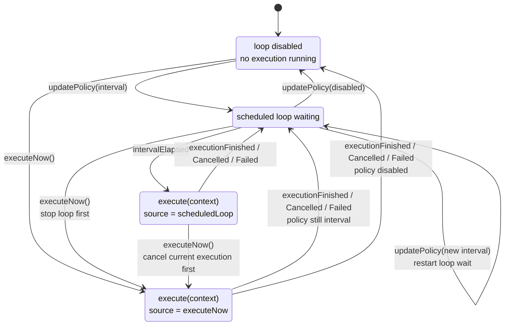
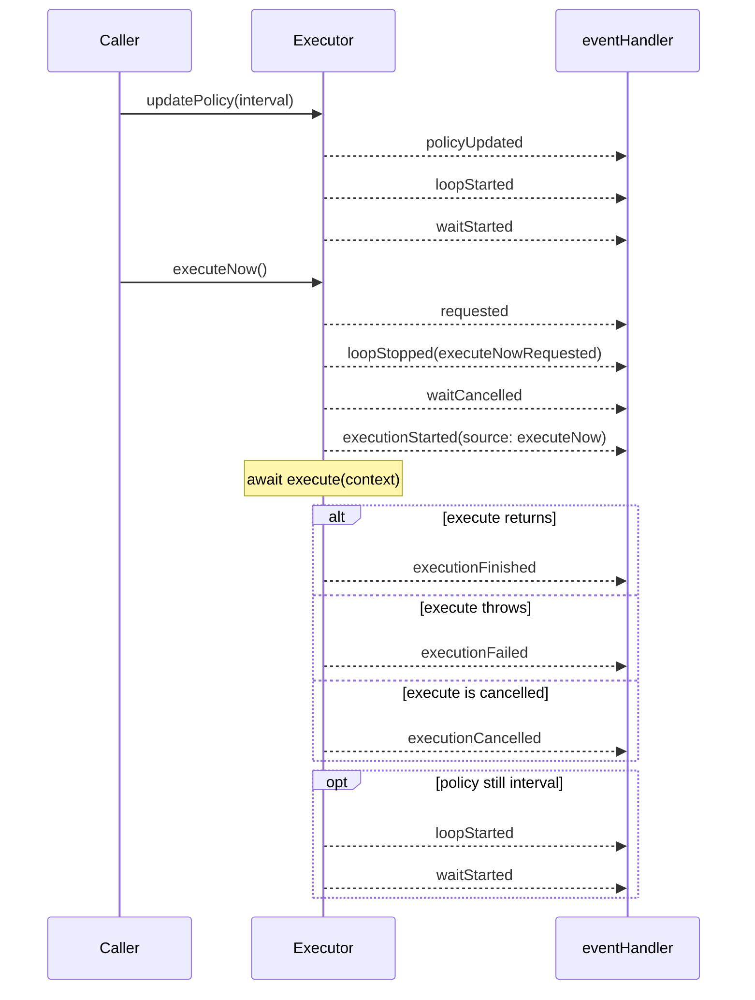

# Swift Sequential Executor

[](https://img.shields.io/badge/Swift-6.0_6.1_6.2-Orange?style=flat-square)
[](https://img.shields.io/badge/Platforms-macOS_|_iOS_|_tvOS_|_watchOS_|_visionOS_|_Linux-yellowgreen)

English｜[简体中文](README-zh-CN.md)

A sequential async executor for interval-based and immediate work.

## Why Not Just Use Timer

[`Timer.scheduledTimer(...)`](https://developer.apple.com/documentation/foundation/timer/scheduledtimer(withtimeinterval:repeats:block:)) works well when the requirement is simply "call me again later." The trouble starts when the callback kicks off asynchronous work and the caller still needs sequencing, cancellation, and manual triggering to behave predictably.

Apple's [Run Loop guide](https://developer.apple.com/library/archive/documentation/Cocoa/Conceptual/Multithreading/RunLoopManagement/RunLoopManagement.html) also makes an important limitation explicit: timers are not a real-time mechanism, and firing depends on the run loop being in the right mode and able to process the callback.

In practice, using `Timer` for this kind of async coordination usually leaves the caller responsible for:

- it schedules callbacks on a run loop, but it does not know whether the previous async task has finished
- `repeats: true` only means the timer keeps firing; it does not mean your work runs sequentially, and overlap or reentrancy control is still your responsibility
- when scheduled triggers and manual triggers coexist, `Timer` provides no coordination model for waiting, replacement, or cancellation

## What SequentialExecutor Solves

- wraps that coordination in one actor-backed type
- keeps execution semantics explicit through `updatePolicy(_:)` and `executeNow()`
- exposes ordered lifecycle events for integration with logging, monitoring, or UI
- keeps the public API intentionally small while leaving runtime details internal

> [!TIP]
> The core API stays focused on `execute`, `eventHandler`, `updatePolicy(_:)`, and `executeNow()`.
>
> Everything else stays internal ;-)

## Requirements

| Platform | Swift Version | Installation | Status |
| --- | --- | --- | --- |
| macOS 13.0+<br>iOS 16.0+<br>tvOS 16.0+<br>watchOS 9.0+<br>visionOS 1.0+ | Swift 6.0+ / Xcode 16.0+ | Swift Package Manager | [](https://github.com/shensven/swift-sequential-executor/actions/workflows/tests-apple.yml) |
| Linux | Swift 6.0+ | Swift Package Manager | [](https://github.com/shensven/swift-sequential-executor/actions/workflows/tests-linux.yml) |

## Installation

### Swift Package Manager

Once your package or Xcode project is set up, add `swift-sequential-executor` to the `dependencies` in `Package.swift` or to the package dependency list in Xcode.

Use the published `1.0.0` release as the package dependency:

```swift
dependencies: [
    .package(url: "https://github.com/shensven/swift-sequential-executor.git", from: "1.0.0")
]
```

Then depend on the `SequentialExecutor` product from your target:

```swift
targets: [
    .target(
        name: "YourTarget",
        dependencies: [
            .product(name: "SequentialExecutor", package: "swift-sequential-executor")
        ]
    )
]
```

## Quick Start

```swift
import Foundation
import SequentialExecutor

let executor = SequentialExecutor(
    execute: {
        try await Task.sleep(for: .seconds(2))
        print("refresh finished")
    },
    eventHandler: { event in
        print(event.kind)
    }
)

await executor.updatePolicy(.init(runLoop: .interval(.seconds(5))))
await executor.executeNow()

```

Run this from any async context, such as app startup, an async test, or a `Task`. `updatePolicy(_:)` enables interval-based execution, and `executeNow()` requests an immediate run.

If you want to debug the fuller runtime behavior, see [Example App](#example-app).

## When to Use

Reach for `SequentialExecutor` when your requirements already imply execution coordination, for example:

- interval-based async work that must not overlap
- a manual immediate run that should replace scheduled waiting when needed
- cancellation coordination before a replacement execution starts
- ordered lifecycle events for logging, monitoring, or UI state

If you only need a timer to fire a simple callback later, and async work coordination is not part of the problem, `Timer` is usually enough.

## Behavior

At a high level, `SequentialExecutor` follows three rules:

- only one execution runs at a time
- `executeNow()` requests an immediate run, but does not forcibly interrupt in-flight work
- the scheduled loop resumes only if the current policy still enables it

If you only need the integration surface, this summary is enough. Expand the sections below if you want the fuller runtime model.

<details>
<summary>State Model</summary>

The visible runtime model can be described with 4 states:

- `Idle`: the scheduled loop is disabled and no execution is in progress
- `Waiting`: the scheduled loop is enabled and is waiting for the next interval
- `ScheduledExecution`: an execution started because the configured interval elapsed
- `ImmediateExecution`: an execution started because `executeNow()` requested an immediate run



</details>

<details>
<summary>Replacement Flow</summary>

`executeNow()` never stacks executions in parallel. Instead, it coordinates a replacement run and waits for cancellation cooperation when work is already in flight.

More concretely:

- if the executor is currently waiting for the next interval, that wait is cancelled first
- if an execution is already in progress, the executor requests cancellation and waits for that execution to return
- the replacement execution starts only after the previous execution has actually finished
- if several `executeNow()` calls arrive while that cancellation coordination is still in progress, older pending requests yield to the newest one
- every immediate request is still recorded separately, but not every request is guaranteed to reach a started execution
- if the in-flight work does not cooperate with cancellation, the replacement execution may be delayed
- once the immediate execution finishes, the scheduled loop resumes only if the current policy still enables it

The sequence below shows a representative path where an interval policy is already active:



</details>

## Example App

The repository includes a SwiftUI example app in [`Examples/SequentialExecutorExample`](Examples/SequentialExecutorExample).

Use it to debug and inspect the runtime behavior of `SequentialExecutor`, including scheduled-loop changes, immediate runs, cancellation coordination, and lifecycle event ordering. The example keeps its visible state event-driven so the waiting and execution timeline can be inspected directly.

## API Details

This section is a reference index for the public API surface and lifecycle types.

### Initializer Configuration

| Configuration | Role | Callback Input |
| --- | --- | --- |
| `execute` | The work closure. `SequentialExecutor` calls it once for each started execution and passes the current execution context. | A `context` value with metadata for the current execution, such as `executionID` and `source`. |
| `eventHandler` | The lifecycle observer. It receives ordered execution events so you can log, monitor, or update external state. The callback is invoked synchronously on the executor's coordination path, so it should stay lightweight and non-blocking. | An `event` value that describes a lifecycle change, including `emittedAt`, `executionID`, `source`, and `kind`. |

If you do not need the `execute` initializer parameter to receive a `context` value, you can also use the convenience initializer:

```swift
let executor = SequentialExecutor(
    execute: {
        try await Task.sleep(for: .seconds(2))
    },
    eventHandler: { event in
        print(event.kind)
    }
)
```

Note: if event handling needs heavier work, hand the event off to another `Task` or queue from inside the callback.

### Policy

| API | Meaning |
| --- | --- |
| `Policy(runLoop: .disabled)` | Disables the scheduled loop. No interval-based execution will be started. |
| `Policy(runLoop: .interval(duration))` | Enables the scheduled loop and waits `duration` between executions. |

Notes:

- `updatePolicy(_:)` is the only public API that changes scheduled-loop behavior.
- `duration` must be greater than zero.

### Execution Context

Reference fields for `SequentialExecutor.ExecutionContext`.

| Field | Meaning |
| --- | --- |
| `executionID` | The unique identifier for the current execution. It matches the corresponding execution lifecycle events. |
| `source` | What triggered this execution: either `executeNow(requestID:)` or `scheduledLoop(loopID:)`. |

### Event Cases

Reference cases for `SequentialExecutor.Event.Kind`.

| `event.kind` | Meaning |
| --- | --- |
| `requested(requestID:)` | An immediate execution was requested through `executeNow()`. |
| `executionStarted(executionID:source:)` | A single execution started, and `execute(context)` is about to be awaited. |
| `executionFinished(executionID:source:)` | A single execution completed successfully. |
| `executionCancelled(executionID:source:)` | A single execution was cancelled. |
| `executionFailed(executionID:source:error:)` | A single execution failed with an error. |
| `policyUpdated(previous:new:)` | The executor policy was updated. |
| `loopStarted(loopID:)` | A new scheduled loop started. |
| `loopStopped(loopID:reason:)` | The current scheduled loop was asked to stop. |
| `loopExited(loopID:)` | The scheduled loop fully exited. |
| `waitStarted(loopID:interval:)` | The loop started waiting for the next interval. |
| `waitCancelled(loopID:)` | The current loop wait was cancelled. |
| `waitFailed(loopID:error:)` | The current loop wait failed with an error. |
| `intervalElapsed(loopID:)` | The configured interval elapsed and the loop can proceed to schedule work. |

### Loop Stop Reasons

Reference cases for `SequentialExecutor.LoopStopReason`.

| `reason` | Meaning |
| --- | --- |
| `executeNowRequested` | The loop was stopped because `executeNow()` requested an immediate execution. |
| `policyDisabled` | The loop was stopped because the current policy disabled scheduled execution. |
| `policyUpdated` | The loop was stopped so a changed policy could restart scheduling from a clean state. |
