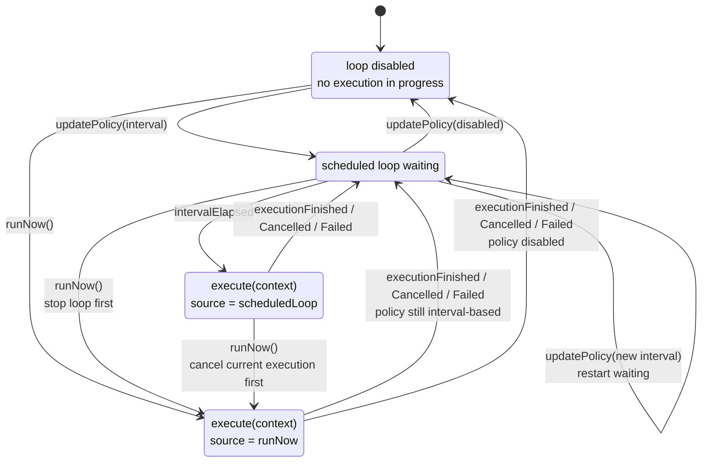
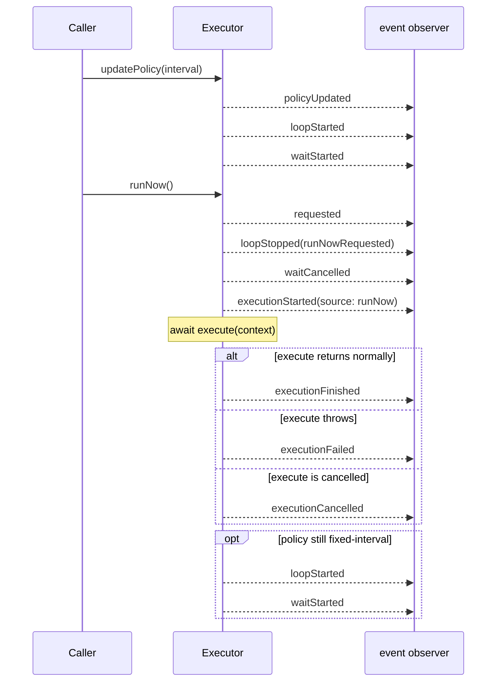

# Swift Sequential Executor

[](https://swiftpackageindex.com/shensven/swift-sequential-executor)
[](https://swiftpackageindex.com/shensven/swift-sequential-executor)

English｜[简体中文](README-zh-CN.md)

A sequential async executor for coordinating scheduled work and immediate execution requests.

## Why Not Just Use Timer

[`Timer.scheduledTimer(...)`](https://developer.apple.com/documentation/foundation/timer/scheduledtimer(withtimeinterval:repeats:block:)) is suitable for requirements like "trigger a callback once after a while." But when that callback needs to perform asynchronous work, callers often still have to deal with the concurrency coordination problems themselves.

## What SequentialExecutor Provides

- Runs async work on a fixed interval without overlapping unfinished executions
- Starts preemptive immediate execution while the scheduled loop is waiting
- Coordinates cancellation and waits for the current execution to finish before starting a replacement execution
- Emits stable started/finished/cancelled/failed events for logging, monitoring, or UI
- Full [API Documentation](https://swiftpackageindex.com/shensven/swift-sequential-executor/main/documentation/sequentialexecutor/)

> [!TIP]
> The core API stays focused on `execute`, `eventHandler`, `events()`, `updatePolicy(_:)`, and `runNow()`.
>
> Everything else stays internal ;-)

## Requirements

| Platform | Swift Version | Installation | Status |
| --- | --- | --- | --- |
| macOS 13.0+<br>iOS 16.0+<br>tvOS 16.0+<br>watchOS 9.0+<br>visionOS 1.0+ | Swift 6.0+ / Xcode 16.0+ | Swift Package Manager | [](https://github.com/shensven/swift-sequential-executor/actions/workflows/tests-apple.yml) |
| Linux | Swift 6.0+ | Swift Package Manager | [](https://github.com/shensven/swift-sequential-executor/actions/workflows/tests-linux.yml) |

## Installation

### Swift Package Manager

Once your Swift package or Xcode project is set up, add `swift-sequential-executor` to `dependencies` in `Package.swift`, or add it to the package dependency list in Xcode.

The example below uses the published `1.0.0` release:

```swift
dependencies: [
    .package(url: "https://github.com/shensven/swift-sequential-executor.git", from: "1.0.0")
]
```

Then depend on the `SequentialExecutor` product from your target:

```swift
targets: [
    .target(
        name: "YourTarget",
        dependencies: [
            .product(name: "SequentialExecutor", package: "swift-sequential-executor")
        ]
    )
]
```

## Quick Start

```swift
import Foundation
import SequentialExecutor

let executor = SequentialExecutor(
    execute: { context in
        print("triggered by \(context.source)")
        try await Task.sleep(for: .seconds(2))
    },
    eventHandler: { event in
        print(event.kind)
    }
)

await executor.updatePolicy(.init(runLoop: .interval(.seconds(5))))
await executor.runNow()

```

You can run this from any async context, such as app startup, an async test, or a `Task`. Each time execution begins, the executor passes the current `ExecutionContext` into the `execute` closure; `updatePolicy(_:)` starts fixed-interval scheduling, and `runNow()` triggers an immediate execution.

If you do not need the `execute` parameter to receive a context value from the initializer, you can also use the simpler convenience initializer:

```swift
let executor = SequentialExecutor {
    try await Task.sleep(for: .seconds(2))
}
```

Note: if event handling itself is heavier work, or if you would rather consume events as an async stream, you can subscribe through `events()` instead:

```swift
let executor = SequentialExecutor {
    try await Task.sleep(for: .seconds(2))
}

let eventTask = Task {
    for await event in await executor.events() {
        print(event.kind)
    }
}

await executor.runNow()
eventTask.cancel()
```

If you want to debug fuller runtime behavior, continue with the [Example App](#example-app).

## Behavior

At a high level, the runtime behavior of `SequentialExecutor` can be understood through 3 points:

- only one execution can be running at any given time
- `runNow()` triggers an immediate execution, but does not forcibly interrupt a task that is already running
- whether scheduling resumes after an immediate execution finishes depends on whether the current policy is still enabled

If you only care about integrating it into your project, this is usually enough. If you want the fuller runtime model, continue with the state model and replacement flow below.

<details>
<summary>State Model</summary>

From the visible runtime state, the executor can be described with 4 states:

- `Idle`: the scheduling loop is disabled and no task is currently executing
- `Waiting`: the scheduling loop is enabled and is waiting for the next interval
- `ScheduledExecution`: an execution started because the interval elapsed
- `ImmediateExecution`: an execution started because `runNow()` requested it



</details>

<details>
<summary>Replacement Flow</summary>

`runNow()` does not stack executions in parallel. It coordinates a replacement execution instead; if a task is already running, it first waits for cancellation cooperation to complete.

More specifically:

- if the executor is currently waiting for the next interval, that wait is cancelled first
- if a task is already executing, the executor first requests cancellation and waits for it to return
- the replacement execution starts only after the previous execution has actually finished
- if multiple `runNow()` calls arrive while cancellation coordination is still in progress, older pending requests yield to the newest one
- every immediate execution request is still recorded separately, but not every request is guaranteed to actually start an execution
- if the current task does not cooperate with cancellation properly, the replacement execution may be delayed
- after this immediate execution finishes, the scheduling loop resumes waiting only if the current policy still allows it

The sequence diagram below shows one representative path where the fixed-interval policy is already active:



</details>

## Example App

The repository includes a SwiftUI example app at [`Examples/SequentialExecutorExample`](Examples/SequentialExecutorExample).

You can use it to debug and observe the runtime behavior of `SequentialExecutor`, including scheduling loop changes, immediate execution, cancellation coordination, and the emission order of lifecycle events. The example keeps visible state event-driven, which makes it easier to inspect waiting and execution timeline changes directly.

## License
`swift-sequential-executor` is released under the MIT License. See [LICENSE](LICENSE) for details.