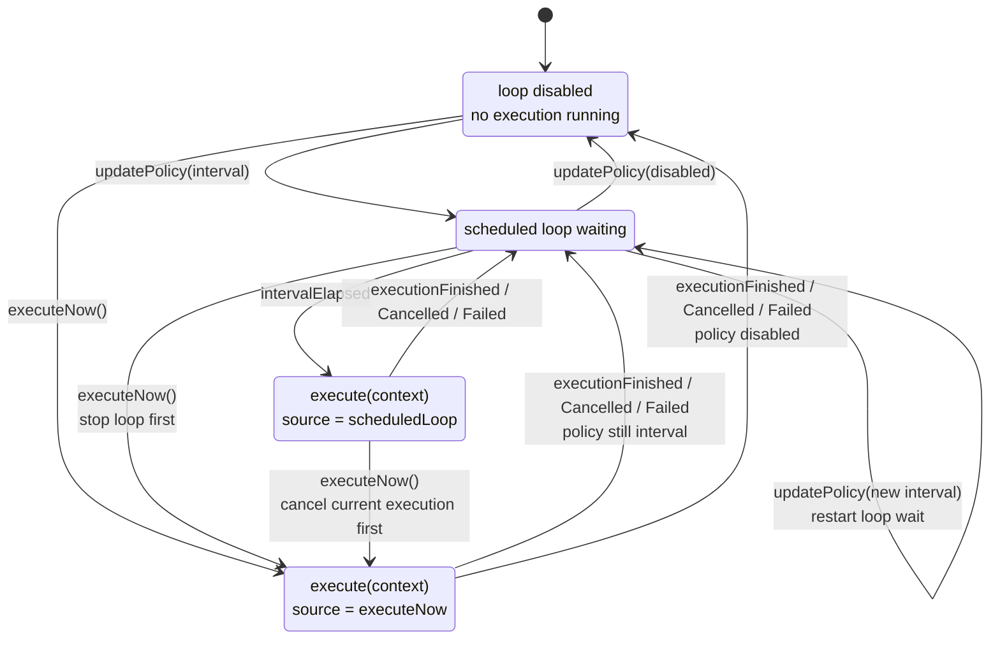
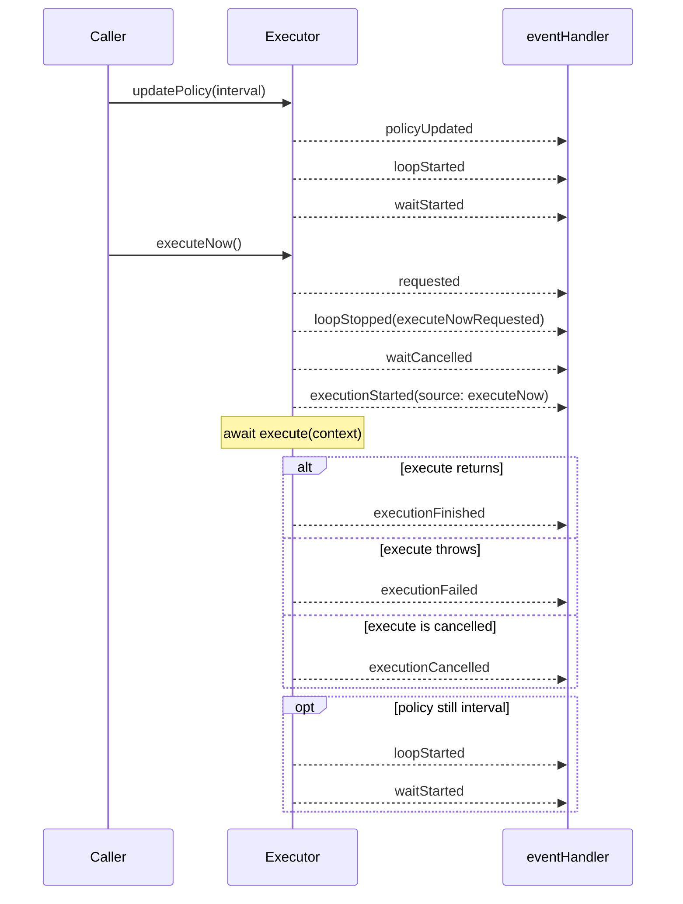

# Swift Sequential Executor

[](https://github.com/shensven/swift-sequential-executor/actions/workflows/tests.yml)

English｜[简体中文](README-zh-CN.md)

## Why?

Apple documents [`Timer.scheduledTimer(...)`](<https://developer.apple.com/documentation/foundation/timer/scheduledtimer(withtimeinterval:repeats:block:)>) as creating a timer on the current thread's run loop, and its [Run Loop guide](https://developer.apple.com/library/archive/documentation/Cocoa/Conceptual/Multithreading/RunLoopManagement/RunLoopManagement.html) makes an important limitation explicit: timers are not a real-time mechanism, and firing depends on the run loop being in the right mode and able to process the callback.

That is fine when the requirement is simply "call me again later." The pain starts when you need to coordinate asynchronous work:

- it schedules callbacks on a run loop, but it does not know whether the previous async task has finished
- `repeats: true` only means the timer keeps firing; it does not mean your work runs sequentially, and overlap or reentrancy control is still your responsibility
- when scheduled triggers and manual triggers coexist, `Timer` provides no coordination model for waiting, preemption, or cancellation

## Enter `SequentialExecutor`

- tasks run in order without overlap, with only one task running at a time
- a single scheduling loop is explicitly controlled through `updatePolicy(_:)`, including start, stop, and interval changes
- `executeNow()` interrupts the current wait and, when needed, cancels the task already in progress so the new request starts first
- `eventHandler` receives ordered callbacks with `emittedAt`, `executionID`, and `source`

> [!TIP]
> The core API stays focused on `execute`, `eventHandler`, `updatePolicy(_:)`, and `executeNow()`.
>
> Everything else stays internal ;-)

## Installation

### Swift Package Manager

Once your package or Xcode project is set up, add `swift-sequential-executor` to the `dependencies` in `Package.swift` or to the package dependency list in Xcode.

This repository does not currently publish version tags, so the example below uses `branch: "main"`:

```swift
dependencies: [
    .package(url: "https://github.com/shensven/swift-sequential-executor.git", branch: "main")
]
```

Then depend on the `SequentialExecutor` product from your target:

```swift
targets: [
    .target(
        name: "YourTarget",
        dependencies: [
            .product(name: "SequentialExecutor", package: "swift-sequential-executor")
        ]
    )
]
```

## Quick Start

```swift
import SequentialExecutor

let executor = SequentialExecutor(
    execute: { context in
        print("run", context.executionID, context.source)
        try await doWork()
    },
    eventHandler: { event in
        print(event.emittedAt, event.kind)
    }
)

await executor.updatePolicy(.init(runLoop: .interval(.seconds(5))))
await executor.executeNow()
```

## Initializer Configuration

| Configuration | Role | Callback Input |
| --- | --- | --- |
| `execute` | The work closure. `SequentialExecutor` calls it once for each started execution and passes the current execution context. | A `context` value with metadata for the current execution, such as `executionID` and `source`. |
| `eventHandler` | The lifecycle observer. It receives ordered execution events so you can log, monitor, or update external state. | An `event` value that describes a lifecycle change, including `emittedAt`, `executionID`, `source`, and `kind`. |

If you do not need the `execute` initializer parameter to receive a `context` value, you can also use the convenience initializer:

```swift
let executor = SequentialExecutor(
    execute: {
        try await doWork()
    },
    eventHandler: { event in
        print(event.kind)
    }
)
```

### Policy

| API | Meaning |
| --- | --- |
| `Policy(runLoop: .disabled)` | Disables the scheduled loop. No interval-based execution will be started. |
| `Policy(runLoop: .interval(duration))` | Enables the scheduled loop and waits `duration` between executions. |

Notes:

- `updatePolicy(_:)` is the only public API that changes scheduled-loop behavior.
- `duration` must be greater than zero.

### Execution Context

| Field | Meaning |
| --- | --- |
| `executionID` | The unique identifier for the current execution. It matches the corresponding execution lifecycle events. |
| `source` | What triggered this execution: either `executeNow(requestID:)` or `scheduledLoop(loopID:)`. |

### Event Cases

| `event.kind` | Meaning |
| --- | --- |
| `requested(requestID:)` | A preemptive immediate execution was requested through `executeNow()`. |
| `executionStarted(executionID:source:)` | A single execution started, and `execute(context)` is about to be awaited. |
| `executionFinished(executionID:source:)` | A single execution completed successfully. |
| `executionCancelled(executionID:source:)` | A single execution was cancelled. |
| `executionFailed(executionID:source:error:)` | A single execution failed with an error. |
| `policyUpdated(previous:new:)` | The executor policy was updated. |
| `loopStarted(loopID:)` | A new scheduled loop started. |
| `loopStopped(loopID:reason:)` | The current scheduled loop was asked to stop. |
| `loopExited(loopID:)` | The scheduled loop fully exited. |
| `waitStarted(loopID:interval:)` | The loop started waiting for the next interval. |
| `waitCancelled(loopID:)` | The current loop wait was cancelled. |
| `waitFailed(loopID:error:)` | The current loop wait failed with an error. |
| `intervalElapsed(loopID:)` | The configured interval elapsed and the loop can proceed to schedule work. |

### Loop Stop Reasons

| `reason` | Meaning |
| --- | --- |
| `executeNowRequested` | The loop was stopped because `executeNow()` requested a preemptive immediate execution. |
| `policyDisabled` | The loop was stopped because the current policy disabled scheduled execution. |
| `policyUpdated` | The loop was stopped so a changed policy could restart scheduling from a clean state. |

## Behavior

### State Model

The visible runtime model can be described with 4 states:

- `Idle`: the scheduled loop is disabled and no execution is in progress
- `Waiting`: the scheduled loop is enabled and is waiting for the next interval
- `ScheduledExecution`: an execution started because the configured interval elapsed
- `ImmediateExecution`: an execution started because `executeNow()` requested an immediate run



### Preemption Flow

`executeNow()` is the key coordination behavior of this type. It never stacks executions in parallel. Instead, it promotes a new immediate run to the highest priority and preempts the current scheduling state first.

More concretely:

- if the executor is currently waiting for the next interval, that wait is cancelled first
- if an execution is already in progress, that execution is cancelled first
- the immediate execution then starts exactly once
- once the immediate execution finishes, the scheduled loop resumes only if the current policy still enables it

The sequence below shows a representative path where an interval policy is already active:



## API Guarantees

- `execute` is the only work callback. Each started execution enters this closure exactly once.
- `eventHandler` is the only lifecycle observer. The executor invokes it synchronously, in emission order, on the executor's coordination path.
- `updatePolicy(_:)` changes only the scheduled loop policy.
- `executeNow()` requests a higher-priority immediate execution and may cancel an in-flight execution first.

The observer contract is intentionally narrow:

- `eventHandler` is observational only. It should stay lightweight and non-blocking.
- If an observer forwards events to another actor, queue, or UI thread, any later display lag belongs to the observer layer, not to `SequentialExecutor`.
- `Event.emittedAt` records when the executor emitted the event.
- `ExecutionContext.executionID` and `ExecutionContext.source` match the corresponding `executionStarted`, `executionFinished`, `executionCancelled`, and `executionFailed` events.

## Example App

The repository includes a SwiftUI Example app in [`Examples/SequentialExecutorExample`](Examples/SequentialExecutorExample).

The Example intentionally separates:

- desired configuration: the RunLoop controls and next-execution strategy selected by the user
- runtime state: the applied loop policy and the wait / execution rings driven by executor events

Inside the Example `ViewModel`, `PreparedExecution` is only a local bridge so the demo can freeze one execution plan per `executionID` before the matching lifecycle events are rendered. The visible runtime state remains event-driven.
