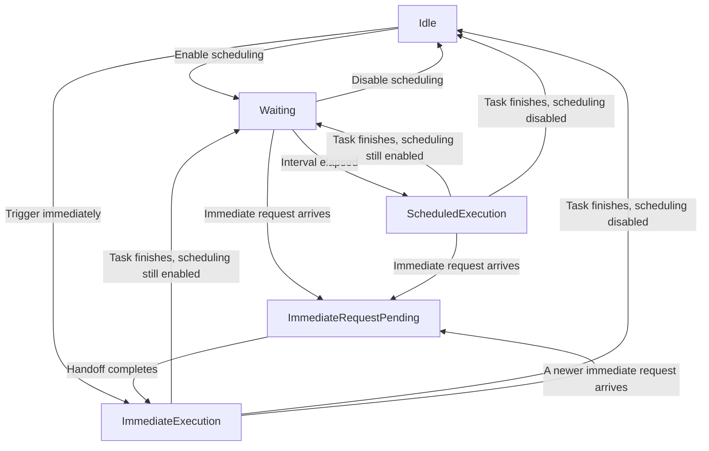
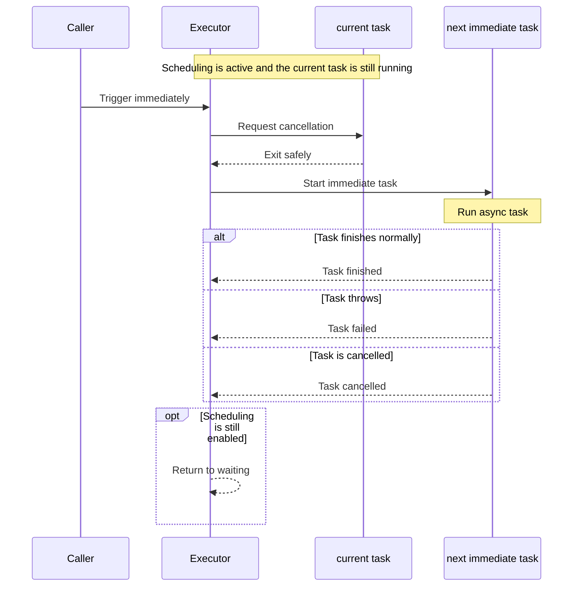

# Swift Sequential Executor

[](https://swiftpackageindex.com/shensven/swift-sequential-executor)
[](https://swiftpackageindex.com/shensven/swift-sequential-executor)

English｜[简体中文](README-zh-CN.md)

Run async tasks one at a time, on schedule or on demand.

## Why Not Just Use Timer

[`Timer.scheduledTimer(...)`](https://developer.apple.com/documentation/foundation/timer/scheduledtimer(withtimeinterval:repeats:block:)) is suitable for requirements like "trigger a callback once after a while." But when that callback needs to perform asynchronous work, callers often still have to deal with the concurrency coordination problems themselves.

## What SequentialExecutor Provides

- [x] Runs async tasks on a fixed interval
- [x] Lets you trigger an async task immediately when needed
- [x] If the previous task is still running, it won't start another one at the same time and safely handles switching between runs
- [x] Emits lifecycle events such as started, finished, cancelled, and failed for logging, monitoring, or UI
- [x] Full [API Documentation](https://swiftpackageindex.com/shensven/swift-sequential-executor/main/documentation/sequentialexecutor/)

> [!TIP]
> The core API stays focused on `execute`, `updatePolicy(_:)`, and `runNow()`.
>
> Everything else stays internal ;-)

## Requirements

| Platform | Swift Version | Installation | Status |
| --- | --- | --- | --- |
| macOS 13.0+<br>iOS 16.0+<br>tvOS 16.0+<br>watchOS 9.0+<br>visionOS 1.0+ | Swift 6.0+ / Xcode 16.0+ | Swift Package Manager | [](https://github.com/shensven/swift-sequential-executor/actions/workflows/tests-apple.yml) |
| Linux | Swift 6.0+ | Swift Package Manager | [](https://github.com/shensven/swift-sequential-executor/actions/workflows/tests-linux.yml) |
| Windows | Swift 6.1+ | Swift Package Manager | [](https://github.com/shensven/swift-sequential-executor/actions/workflows/tests-windows.yml) |

## Installation

### Swift Package Manager

Once your Swift package or Xcode project is set up, add `swift-sequential-executor` to `dependencies` in `Package.swift`, or add it to the package dependency list in Xcode.

The example below uses the published `1.0.0` release:

```swift
dependencies: [
    .package(url: "https://github.com/shensven/swift-sequential-executor.git", from: "1.0.0")
]
```

Then depend on the `SequentialExecutor` product from your target:

```swift
targets: [
    .target(
        name: "YourTarget",
        dependencies: [
            .product(name: "SequentialExecutor", package: "swift-sequential-executor")
        ]
    )
]
```

## Quick Start

```swift
import Foundation
import SequentialExecutor

let executor = SequentialExecutor(
    execute: { context in
        print("triggered by \(context.source)")
        try await Task.sleep(for: .seconds(2))
    },
    eventHandler: { event in
        print(event.kind)
    }
)

await executor.updatePolicy(.init(runLoop: .interval(.seconds(5))))
// await executor.runNow()

```

You can run this from any async context, such as app startup, an async test, or a `Task`. Each time execution begins, the executor passes the current `ExecutionContext` into the `execute` closure; `updatePolicy(_:)` starts fixed-interval scheduling, and `runNow()` triggers an immediate execution.

If you do not need the `execute` parameter to receive a context value from the initializer, you can also use the simpler convenience initializer:

```swift
let executor = SequentialExecutor {
    try await Task.sleep(for: .seconds(2))
}
```

Note: if event handling itself is heavier work, or if you would rather consume events as an async stream, you can subscribe through `events()` instead:

```swift
let executor = SequentialExecutor {
    try await Task.sleep(for: .seconds(2))
}

let eventTask = Task {
    for await event in await executor.events() {
        print(event.kind)
    }
}

await executor.runNow()
```

If you want to debug fuller runtime behavior, continue with the [Example App](#example-app).

## Behavior

From a usage perspective, there are 3 core behaviors to keep in mind:

- Only one async task runs at a time
- Tasks can run on a fixed interval or be triggered immediately when needed
- When a new task needs to take over, the current task is asked to exit through cooperative task cancellation instead of being interrupted forcefully

If you only care about integrating it into your project, this is usually enough. If you want to understand the full state machine design, continue with the coordination model and handoff flow below.

<details>
<summary>Coordination Model</summary>

The executor has 5 main states, and the diagram below shows how they flow:

- `Idle`: no task is running and no immediate request is pending
- `Waiting`: waiting for the next scheduled trigger
- `ScheduledExecution`: a scheduled task is running
- `ImmediateRequestPending`: an immediate request has arrived and handoff is in progress
- `ImmediateExecution`: an immediately triggered task is running



- If the interval is updated while in `Waiting`, the executor remains in `Waiting`
- If a newer immediate request arrives while in `ImmediateRequestPending`, the state does not change, but the older pending request yields to the newest one

</details>

<details>
<summary>Handoff Flow</summary>

When you trigger an immediate run, the executor does not pile a new task on top of the current one. It first clears the current state, then hands control over to the new run.

More specifically:

- If the executor is still waiting for the next scheduled trigger, that wait ends first
- If a task is already running, the executor asks it to exit safely through cooperative cancellation
- The new immediate task starts only after the previous task has actually finished
- If multiple immediate requests arrive during handoff, the latest one takes over and older pending requests yield
- If the current task does not cooperate with cancellation, the new immediate task has to keep waiting
- After the immediate task finishes, the executor goes back to waiting if scheduling is still enabled

The sequence diagram below shows a typical path where a task is already running and an immediate trigger arrives:



</details>

## Example App

The repository includes a SwiftUI example app at [`Examples/SequentialExecutorExample`](Examples/SequentialExecutorExample).

You can use it to debug and observe the runtime behavior of `SequentialExecutor`, including scheduling loop changes, immediate execution, cancellation coordination, and the emission order of lifecycle events. The example keeps visible state event-driven, which makes it easier to inspect waiting and execution timeline changes directly.

## License
`swift-sequential-executor` is released under the MIT License. See [LICENSE](LICENSE) for details.
