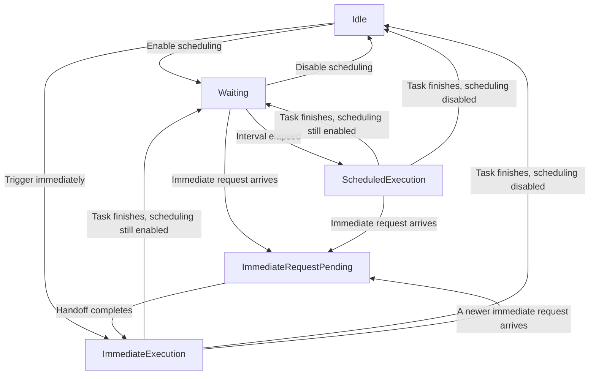
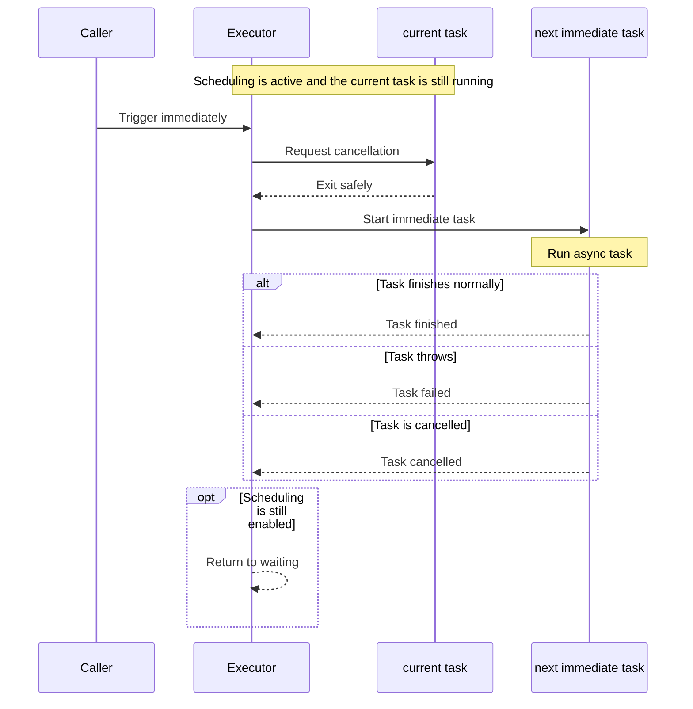

# Swift Sequential Executor

[](https://swiftpackageindex.com/shensven/swift-sequential-executor)
[](https://swiftpackageindex.com/shensven/swift-sequential-executor)

English｜[简体中文](README-zh-CN.md)

Run async tasks one at a time, on schedule or on demand.

## Why Not Just Use Timer

[`Timer.scheduledTimer(...)`](https://developer.apple.com/documentation/foundation/timer/scheduledtimer(withtimeinterval:repeats:block:)) schedules synchronous callbacks. Using it for asynchronous work requires additional coordination to prevent overlap and handle cancellation.

## What SequentialExecutor Provides

- [x] Runs async tasks with a fixed delay between executions
- [x] Supports immediate execution that takes precedence over scheduling
- [x] Uses a state machine to coordinate interval waiting, async task execution, and immediate trigger requests across different runtime states
- [x] Provides a state-machine event callback interface for logging, monitoring, or UI integration
- [x] Full [API Documentation](https://swiftpackageindex.com/shensven/swift-sequential-executor/main/documentation/sequentialexecutor/)

> [!TIP]
> The core API stays focused on `execute`, `updatePolicy(_:)`, and `runNow()`.
>
> Everything else stays internal ;-)

## Requirements

| Platform | Swift Version | Installation | Status |
| --- | --- | --- | --- |
| macOS 13.0+<br>iOS 16.0+<br>tvOS 16.0+<br>watchOS 9.0+<br>visionOS 1.0+ | Swift 6.0+ / Xcode 16.0+ | Swift Package Manager | [](https://github.com/shensven/swift-sequential-executor/actions/workflows/tests-apple.yml) |
| Linux | Swift 6.0+ | Swift Package Manager | [](https://github.com/shensven/swift-sequential-executor/actions/workflows/tests-linux.yml) |
| Windows | Swift 6.1+ | Swift Package Manager | [](https://github.com/shensven/swift-sequential-executor/actions/workflows/tests-windows.yml) |

## Installation

### Swift Package Manager

Once your Swift package or Xcode project is set up, add `swift-sequential-executor` to `dependencies` in `Package.swift`, or add it to the package dependency list in Xcode.

Add version `1.1.0` or later:

```swift
dependencies: [
    .package(url: "https://github.com/shensven/swift-sequential-executor.git", from: "1.1.0")
]
```

Then depend on the `SequentialExecutor` product from your target:

```swift
targets: [
    .target(
        name: "YourTarget",
        dependencies: [
            .product(name: "SequentialExecutor", package: "swift-sequential-executor")
        ]
    )
]
```

## Quick Start

```swift
import Foundation
import SequentialExecutor

let executor = SequentialExecutor(
    execute: { context in
        print("triggered by \(context.source)")
        try await Task.sleep(for: .seconds(2))
    },
    eventHandler: { event in
        print(event.kind)
    }
)

await executor.updatePolicy(.init(runLoop: .interval(.seconds(5))))
// await executor.runNow()
```

Each execution receives an `ExecutionContext` containing its identifier and trigger.
Use `updatePolicy(_:)` to configure fixed-delay scheduling and `runNow()` to request
an immediate execution that takes precedence over the scheduled loop.

If you do not need the `execute` parameter to receive a context value from the initializer, you can also use the simpler convenience initializer:

```swift
let executor = SequentialExecutor {
    try await Task.sleep(for: .seconds(2))
}
```

The event handler is `@Sendable` and runs synchronously on the executor's coordination path. Keep it lightweight, and do not synchronously access state isolated elsewhere, such as MainActor UI state. For isolated or asynchronous event processing, subscribe through `events()` instead:

```swift
let executor = SequentialExecutor {
    try await Task.sleep(for: .seconds(2))
}

let eventTask = Task {
    for await event in await executor.events() {
        print(event.kind)
    }
}

await executor.runNow()
```

### Immediate Execution Results

`runNow()` returns a `RunNowResult`. Errors thrown by `execute` are returned as
`.failed` and are also delivered as `executionFailed` events:

```swift
switch await executor.runNow() {
case let .finished(context):
    print("finished: \(context.executionID)")
case let .cancelled(context):
    print("cancelled: \(context.executionID)")
case let .failed(context, error):
    print("failed: \(context.executionID), \(error)")
case let .superseded(requestID, byRequestID):
    print("request \(requestID) was superseded by \(byRequestID)")
}
```

| Result | Meaning |
| --- | --- |
| `finished` | The request started and completed successfully. |
| `cancelled` | The request started and ended through cancellation. |
| `failed` | The request started and threw a non-cancellation error. |
| `superseded` | A newer request replaced it before it started. |

Cancelling the caller's `Task` does not withdraw a request that was submitted to
the executor. A newer `runNow()` request is what asks the current execution to
cancel, and cancellation remains cooperative.

The return value is discardable when the caller doesn't need the outcome.

### Choosing the Right Lifetime

`SequentialExecutor` is a good fit for a long-lived scheduler that needs both
fixed-delay execution and latest-request-wins handoff. Keep the executor in the
service or model that owns that scheduling policy.

For a loop whose lifetime exactly matches one SwiftUI view, a structured
`.task(id:)` loop with `Clock.sleep(for:)` is often simpler: SwiftUI cancels the
task when the view disappears. `SequentialExecutor` intentionally owns its work
after submission, so cancellation of a `.task` or `.refreshable` caller does not
stop an accepted `runNow()` request.

The `execute` closure must respond to cooperative cancellation promptly. If it
waits for an unstructured child task or an API that ignores cancellation, a newer
`runNow()` request cannot take over until that work returns.

Calls to `updatePolicy(_:)` from independent tasks are applied in actor-arrival
order, which is not guaranteed to match task creation order. Give policy updates
one owner or otherwise serialize them; do not launch competing fire-and-forget
policy updates from unrelated tasks.

### Event Observation

`events()` observes events emitted after the subscription is created and does not
replay earlier events. Its default buffer is unbounded. Use
`events(bufferingPolicy:)` when a bounded buffer is more appropriate; bounded
buffers may drop events without a separate notification. Correlate loop lifecycle
events by `loopID`: events for one loop remain ordered, while events from an exiting
loop and its replacement may interleave.

## Behavior

`SequentialExecutor` provides these guarantees:

- Only one async task runs at a time
- Scheduled tasks use a fixed delay and can also be triggered immediately when needed
- When a new task takes over, the current task exits through cooperative cancellation

### Scheduling Semantics

Scheduled execution uses fixed-delay rather than fixed-rate semantics:

```text
wait interval → execute → wait interval → execute
```

- Enabling scheduling waits for one full interval before the first execution.
- The next interval begins only after the previous execution exits, so execution time is not subtracted from the delay.
- Disabling scheduling cancels an active wait, but lets an execution that has already started exit normally.
- Changing the interval restarts an active wait. If an execution is already running, the new delay is applied after it exits.

<details>
<summary>Coordination Model</summary>

The executor has 5 main states, and the diagram below shows how they flow:

- `Idle`: no task is running and no immediate request is pending
- `Waiting`: waiting for the next scheduled trigger
- `ScheduledExecution`: a scheduled task is running
- `ImmediateRequestPending`: an immediate request has arrived and handoff is in progress
- `ImmediateExecution`: an immediately triggered task is running


```mermaid
flowchart TD
    Idle["Idle"]
    Waiting["Waiting"]
    ScheduledExecution["ScheduledExecution"]
    ImmediateRequestPending["ImmediateRequestPending"]
    ImmediateExecution["ImmediateExecution"]

    Idle -->|Enable scheduling| Waiting
    Idle -->|Trigger immediately| ImmediateExecution

    Waiting -->|Interval elapsed| ScheduledExecution
    Waiting -->|Immediate request arrives| ImmediateRequestPending
    Waiting -->|Disable scheduling| Idle

    ScheduledExecution -->|Task finishes, scheduling still enabled| Waiting
    ScheduledExecution -->|Task finishes, scheduling disabled| Idle
    ScheduledExecution -->|Immediate request arrives| ImmediateRequestPending

    ImmediateRequestPending -->|Handoff completes| ImmediateExecution

    ImmediateExecution -->|Task finishes, scheduling still enabled| Waiting
    ImmediateExecution -->|Task finishes, scheduling disabled| Idle
    ImmediateExecution -->|A newer immediate request arrives| ImmediateRequestPending
```

- If the interval is updated while in `Waiting`, the executor remains in the abstract `Waiting` state, but cancels the old wait and starts a new one
- If a newer immediate request arrives while in `ImmediateRequestPending`, the state does not change, but the older pending request yields to the newest one

</details>

<details>
<summary>Handoff Flow</summary>

An immediate request performs a cooperative handoff instead of starting concurrent work:

- If the executor is still waiting for the next scheduled trigger, that wait ends first
- If a task is already running, the executor asks it to exit safely through cooperative cancellation
- The new immediate task starts only after the previous task has actually finished
- If multiple immediate requests arrive during handoff, the latest one takes over and older pending requests yield
- If the current task does not cooperate with cancellation, the new immediate task has to keep waiting
- After the immediate task finishes, the executor goes back to waiting if scheduling is still enabled

The sequence diagram below shows a typical path where a task is already running and an immediate trigger arrives:


```mermaid
sequenceDiagram
    participant Caller
    participant Executor
    participant CurrentTask as current task
    participant NextTask as next immediate task

    Note over Executor,CurrentTask: Scheduling is active and the current task is still running

    Caller->>Executor: Trigger immediately
    Executor->>CurrentTask: Request cancellation
    CurrentTask-->>Executor: Exit safely
    Executor->>NextTask: Start immediate task
    Note over NextTask: Run async task

    alt Task finishes normally
        NextTask-->>Executor: Task finished
    else Task throws
        NextTask-->>Executor: Task failed
    else Task is cancelled
        NextTask-->>Executor: Task cancelled
    end

    opt Scheduling is still enabled
        Executor-->>Executor: Return to waiting
    end
```

</details>

## Example App

The repository includes a SwiftUI example app at [`Examples/SequentialExecutorExample`](Examples/SequentialExecutorExample). See the [Example App guide](Examples/README.md) for instructions.

You can use it to debug and observe the runtime behavior of `SequentialExecutor`, including scheduling loop changes, immediate execution, cancellation coordination, and the emission order of lifecycle events. The example keeps visible state event-driven, which makes it easier to inspect waiting and execution timeline changes directly.


## License
`swift-sequential-executor` is released under the MIT License. See [LICENSE](LICENSE) for details.
